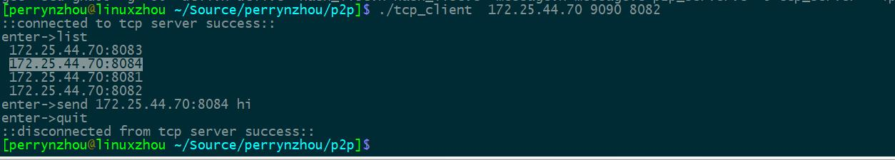
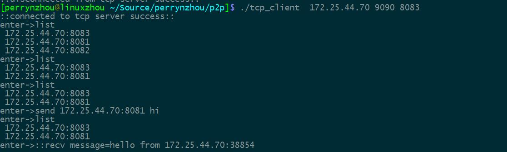

### 介绍
- 该例子简单模拟了p2p协议的通信方式，采用C/S架构，服务端维护客户端信息，客户端与客户端之间直接通信，每个客户端之间的识别是靠服务端告诉客户端

### 服务端设计

- 服务端负责注册客户端的ID，维护客户端的信息，客户端的上下线时刻必须告诉服务端的自己的状态，服务端和客户端之间通信采用的TCP协议，通信量比较少，这部分必须保证不丢包,因此采用了tcp协议
- 服务端维护一个哈希表，每个哈希表存储的是上线的客户端信息，每当客户端下线，客户端必须告诉服务端自己的状态，服务端负责清理该客户端

### 客户端设计
- 客户端 与其他客户端直接通信，客户端之间的相互识别是通过服务端推送过来的，客户端之间的通信协议采用UDP，因为客户端之间数据传输采用UDP协议，因为该协议简单，在真实场景中，可以基于UDP构造可靠的数据传输
- 客户端必须维护一个哈希表，来保存该客户端缓存其他的客户端的信息
- 客户端有2个工作线程，一个是从标准输入不断的输入自定义命令（目前支持list/quit/send/all命令),list命令查看自己当前能看的客户端信息，quit命令告诉服务器自己退出，send是给其他的客户端发送信息。第二个线程是负责接收给自己发送的数据的线程，一旦发现有发送给自己的消息，就立马打印出来。

### 编译、安装、使用

- 下载源代码
```
git clone https://github.com/perrynzhou/p2p.git
```
- 编译
```
cd p2p && make 
```

- 服务端运行
```
./tcp_server 8081
```

- 客户端运行
```
./tcp_client
```

### 运行实例






